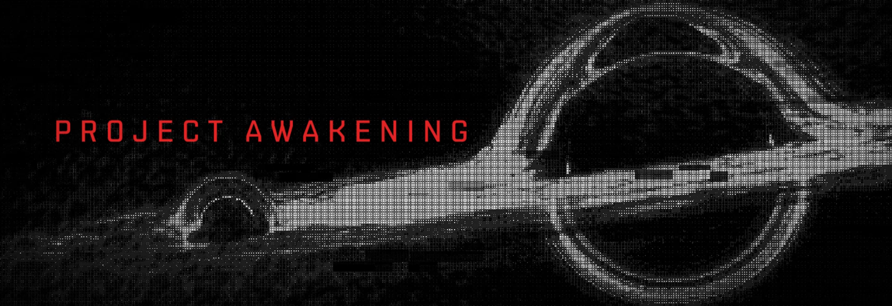

# World Chain Contracts



This repository contains the smart contract code supporting Project Awakening and targeted for deployment to the world chain. It contains of two separate code paths. The standard contracts are plain solidity contracts intended as support structure. The mud contracts are the functionality or *business logic* itself.

# Quickstart

Install necessary dependencies:

```
npm install -g pnpm
pnpm install 
``` 

To start developing against the world and all of the CCP modules run:

```
pnpm run dev
```

To interact with the MUD world in a raw fashion you can use the cast CLI tool.

```bash
#  Populate with working values
DEV_PRIVATE_KEY=0xac0974bec39a17e36ba4a6b4d238ff944bacb478cbed5efcae784d7bf4f2ff80
DEV_WORLD_ADDRESS=0x6e9474e9c83676b9a71133ff96db43e7aa0a4342
cast send $DEV_WORLD_ADDRESS --rpc-url http://localhost:8545 --private-key $DEV_PRIVATE_KEY  "createSmartStorageUnit(string,string)" "name" "description"
```

In the example above the method being invoked belongs to a system in the root namespace. To invoke a method in a different namespace i.e. the non-root namespace. The method name should be prefixed with the namespace name and an underscore e.g. `namespaced_createSmartStorageUnit`.

# Running with docker

You can also run a deployer image for the Awakening world against a local node to replicate the world in a local environment.

Pull the latest released docker image: Current version [0.0.7](https://github.com/projectawakening/world-chain-contracts/pkgs/container/world-chain-deployer-image/220295954?tag=0.0.7)
```bash
docker pull ghcr.io/projectawakening/world-chain-deployer-image:0.0.7
```

Run it directly against a running local node:
```bash
export TEST_PRIVATE_KEY=0xPRIVATE_KEY_FOR_FUNDED_EOA
export RPC_URL=http://LOCAL_RPC_ENDPOINT # For OS X this would be host.docker.internal:8545 docker can acess localhost

docker run --name world-deployer -it ghcr.io/projectawakening/world-chain-deployer-image:0.0.7 --rpc-url $RPC_URL --private-key $TEST_PRIVATE_KEY
```
After running this the world has been deployed to the local node with all functionality. Should you want to interact with the world in a programmatic way you can extract from the docker image the abis by running:
```bash
docker cp world-deployer:/monorepo/abis .
```

This gives you immediate acccess to the ABIs for the world which you can run abigen against or use in your decentralized applications.

# Development

The development stack consists of:

- An anvil node for etherum local development
- Scripts deploying a mud world and all or selected modules for developments

We are running the anvil node explicitly ourselves for three reasons:

- Making the development environment as similar to live ones as possible
- Decoupling from MUD's opinionated dev tools
- Having a stand alone development node allows us to deploy modules in a deterministic an selective manner

# Contribute
We'd love your support! There are many ways you can participate and help build. Check out the [contribution guide](CONTRIBUTING.md)!

# License 
The contents of this repository are open-source software under the [MIT license](./LICENSE).
